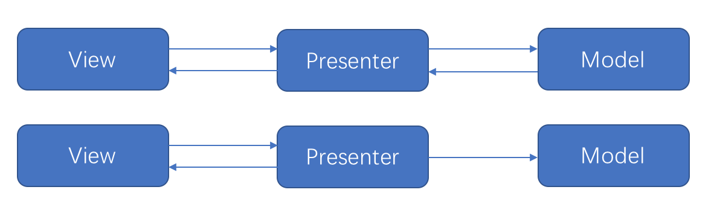

# PoromotoTodo

基于番茄时间管理法的待办事项安卓app

## 一、架构：MVP

1. model为业务（领域层）模型，负责处理信息存取和该领域业务逻辑实现
   - bean：数据对象，负责数据存取
2. presenter负责连接model和ui（view），将数据从model传到view，同时处理一些设计到多个model的复杂业务逻辑
3. View，在项目中为ui，负责界面显示和与用户的交互（显示和输入）
   - ui：界面的逻辑代码部分
     - activity：活动，对应安卓组件activity
     - fragment：碎片，对应安卓组件fragment
   - res：资源，包括界面和配置
4. net，涉及网络的访问的类

## 二、项目配置

正常无需修改

1. 最低API：Android6.0
2. Gradle version：6.5
3. Android Gradle Plugin version：4.1.1
4. JDK：1.8
5. SDK：Android 11.0(R)

## 三、效果展示

